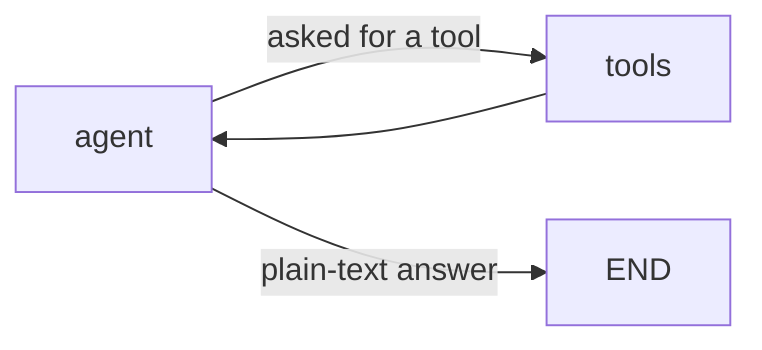
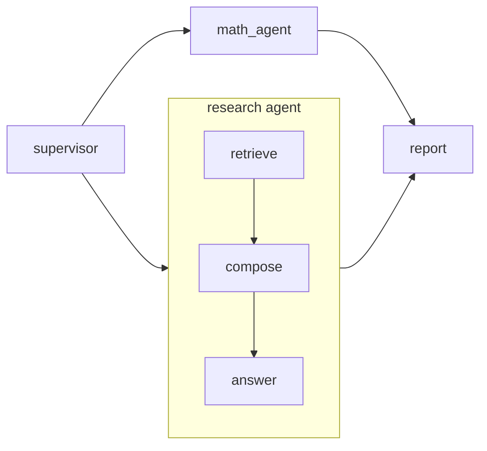

# Examples

Four demos in `examples/`, in increasing order of scope. The
[guide](guide/README.md) teaches the concepts; these walkthroughs show them
assembled. Every demo runs fully offline against the mock backend and switches to a
live provider through the environment alone (see the
[configuration table](../README.md#configuration)).

Binaries land in `build/windows-msvc/examples/Debug/` (Windows) or
`build/linux/examples/` (Linux).

## chat_demo: the backend abstraction

Three scenes against one `LLMBackend`, showing that offline and live runs share the
same code:

1. **A single-turn question**: build a `ChatRequest`, call `generate`, print the
   reply.
2. **Streaming**: the same call through `generate_stream`, printing tokens as they
   arrive with the `on_text` convenience wrapper.
3. **A tool round-trip**: the model is given a `get_weather` tool definition and asks
   to call it; the demo runs the "tool", appends a `ToolResultBlock` to the
   conversation, and the model folds the result into its final answer.

The mock backend's canned handler at the bottom of the file is worth reading: it is
the same pattern the test suite uses to make provider behavior deterministic in CI.

## react_demo: a minimal ReAct agent

An LLM node and a tool node joined in a loop:



The system prompt tells the model to use the `calculator` tool for arithmetic instead
of computing it itself. A conditional edge (`tools_router`) inspects the model's last
message: a tool request routes to the tool node, which executes the call with
validated arguments and hands the conversation back; a plain-text answer ends the
run. The whole conversation accumulates on one appending `messages` channel, and a
`max_steps` budget bounds the loop.

Things to look at in the code:

- `make_calculator_registry`: a JSON-schema tool definition paired with a C++
  callback; the prebuilt graph advertises it to the model and executes what the
  model calls.
- `run_agent`: the entire agent is one `make_react_agent` call plus `chat_state`.
  The manual wiring it performs inside is built by hand in
  [guide step 3](guide/03-tools.md).

## orchestration_demo: supervisor, sub-agents, checkpoints, human-in-the-loop

The largest demo: a supervisor graph that routes each task to one of two sub-agents
and merges their results into a report.



Each sub-agent is a complete graph of its own, mounted as a single node with
`make_subgraph_node`. Because the parent and child have different state schemas, each
mount supplies an *enter* function (parent state to child state) and a *report*
function (finished child state to an update for the parent); see `enter_research` and
`report_research` in the code.

The run exercises most of the orchestration engine at once:

- **RAG**: the research agent's `retrieve` node embeds the query and pulls the two
  most relevant documents from the SQLite vector store (a seeded three-document
  corpus, one of which is a decoy).
- **Event streaming**: a subscriber on the `EventBus` prints super-step starts and
  streams tokens as they are generated.
- **Checkpointing**: every super-step is saved to SQLite under the run id.
- **Human-in-the-loop**: `interrupt_before = {"report"}` pauses the run before the
  final node. The demo prints the pending node, reloads the latest checkpoint from
  SQLite, deserializes the state, and resumes: exactly the shape of a real approval
  flow, minus the human.

## eval_demo: the measurement stack

Runs an agent over the built-in text-to-SQL task suite (REF-A) and takes it through
the full measurement loop:

1. **Run the suite**: the harness fans the agent across the train split concurrently
   and scores each instance by executing the predicted and gold SQL and comparing
   result sets.
2. **Report**: accuracy with a 95% confidence interval, pinned to the seed,
   framework version, and git commit that produced it:

   ```text
   suite      ref-a-text-to-sql
   instances  6  (failures: 0)
   accuracy   0.833  [0.436, 0.970] 95% CI
   pinned     seed=0 version=0.0.1 commit=0bb5473e4ca7 eval_id=01M1...
     count-customers      1.0
     older-than-30        0.0
     ...
   ```

3. **Record a baseline**: the report is stored in SQLite and marked as the suite's
   baseline, the number every later run is compared against.
4. **Export training data**: the traces whose SQL actually verified are written out
   as JSONL training examples. This is the distillation pipeline in miniature: run a
   strong model over a suite, keep only what the verifier accepted, and that dataset
   trains a smaller student.

The offline scripted agent makes two deliberate mistakes so the report is
interesting: one query writes `>=` where the question says `>`, a near-miss that
string comparison would accept but the result-set verifier catches, and one instance
refuses to answer at all.

With a live backend configured, the same run scores a real model instead: the agent
becomes a single system prompt describing the schema, temperature 0, one SQL query
back.
